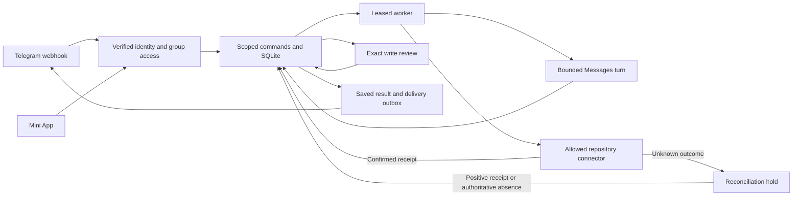

# Asmo Tag

Asmo Tag is a shared Telegram teammate from Asmo AI. Mention it, give it a scoped task, steer the work together, inspect cited sources, and review an exact issue before it can be created. Configure sits beside the conversation. Administration stays separate.

This repository contains a runnable local build and real Telegram, OpenAI Responses, GitHub App, and Notion OAuth adapters. The local preview uses invented data and explicitly simulated providers. Live integration and release gates have not passed. The complete product target is broader than this build.

## Run the local preview

Use Node 22.22 or newer. SQLite is embedded in Node, so no database server, account, or password is needed. Fixture data uses `work/asmo-fixture.sqlite`. The connected pilot uses a separate file, `work/asmo-pilot.sqlite`.

```sh
npm exec --yes --package=pnpm@12.9.1 -- pnpm install
npm exec --yes --package=pnpm@12.9.1 -- pnpm db:local
npm exec --yes --package=pnpm@12.9.1 -- pnpm web:build
cp .env.example .env
npm exec --yes --package=pnpm@12.9.1 -- pnpm dev
```

Open <http://127.0.0.1:8787/?fixture=1>. The explicit fixture flag reveals a synthetic actor selector. Maya is a member, Sam is a manager, and the owner can control workspace sharing. Members can start, steer, stop, and resume shared tasks. Managers review writes. Each person's DM remains separate.

The `npm exec` prefix avoids the broken global pnpm launcher observed on the original workstation. A working pnpm 12.9.1 installation can run the package scripts directly. No global configuration change is required.

The server binds loopback by default. Fixture mode rejects public binding, hostile Host headers, and cross-origin requests. Do not expose the disposable database or fixture authentication publicly.

```sh
npm exec --yes --package=pnpm@12.9.1 -- pnpm demo
```

`demo` runs a simulated discussion-to-issue workflow through the real database. It approves only its synthetic issue draft. Stop the server with Ctrl-C. SQLite has no database daemon to stop. Restart preserves tasks, deduplication records, and fixture issue receipts.

## Verify

Database tests create their own temporary files and generated workspaces. They do not truncate shared tables or touch live services.

```sh
npm exec --yes --package=pnpm@12.9.1 -- pnpm test
npm exec --yes --package=pnpm@12.9.1 -- pnpm check
npm exec --yes --package=pnpm@12.9.1 -- pnpm web:check
npm exec --yes --package=pnpm@12.9.1 -- pnpm build
npm exec --yes --package=pnpm@12.9.1 -- pnpm web:build
```

Database suites run by default against disposable SQLite files. No database environment variable is needed. The recovery test forks an owned disposable process, persists a synthetic issue, kills that process with SIGKILL before the database receipt, and verifies positive reconciliation after reopening the store.

## Design

One TypeScript application and SQLite own the task lifecycle. React and Vite provide the Mini App. `src/core.ts` holds typed commands, tasks, sources, transcripts, approvals, effects, and leases. `src/store` owns transactional policy, explicit workspace isolation, reservations, dependency invalidation, and durable queues. Providers and connectors validate their external formats before entering those contracts.



Stop prevents further dispatch and preserves completed effects. It cannot undo a request already sent to a provider. Unknown writes are held for reconciliation. A bounded GitHub search with no match does not prove absence and cannot authorize another write.

Workspace sharing requires the actual workspace owner to remain authorized in the source group. Only active curated facts cross groups. Raw messages, files, and tool receipts stay scoped. Memory revisions and source snapshots track downstream tasks. Forgetting or correcting evidence scrubs affected saved answers, transcripts, and undelivered output. Exact internal effect payloads remain for recovery, and external provider copies may remain. This is invalidation with disclosed retention, not complete erasure.

Model context selects up to 300 raw sources from the current group. Task-linked inputs and receipts have priority; remaining slots use recent evidence. Active memory can add content-free evidence references beyond that window. Omitted sources do not prove that an event never occurred. Precise dependency invalidation preserves unrelated completed work. Source forgetting also redacts opaque in-flight receipts in the source group.

Local admission limits are 20 active tasks per scope, 100 pending tasks per workspace, and 500 ready or leased jobs per workspace. Each scope permits two current model leases. This does not bound physical provider calls already dispatched before steering. Passive ingestion has no retention or flood cap yet. Held notices require operator inspection and do not automatically retry when capacity returns. The complete L20 gate remains open.

SQLite has no PostgreSQL row-level security or database roles. Workspace predicates, membership checks, DM ownership, and composite foreign keys enforce the application boundaries. Anyone who can directly open the database file can bypass application policy, so restrict filesystem access.

Short `BEGIN IMMEDIATE` transactions serialize writes. A process-wide file gate prevents async transactions from interleaving across local connections. External provider calls happen outside database transactions. The current Node runtime bundles SQLite 3.50.4, so this build uses rollback journaling rather than WAL. See [SQLite's advisory](https://www.sqlite.org/wal.html#walresetbug).

## Connect real services

Live setup is an operator path, not a deployment performed by this build. Set `ASMO_MODE=live` and every required value in `.env.example`. Configure OpenAI Responses, an explicit model ID, all three current token prices, an adequate reservation, a bot token, and a webhook secret. GitHub and Notion are optional. Register their operator apps once, then managers use Configure → Tools and access → Connect. Users authorize at the provider and choose repositories or pages. Manual installation tokens are no longer required. There is no live-to-fixture fallback.

Run one active application/connector worker process. Rotating OAuth-token refresh is not coordinated across multiple app processes. Expose the application behind an HTTPS reverse proxy only after its connected acceptance checks pass. Configure the bot's Mini App direct link, client URL, and authenticated webhook. Request the member and bot-membership updates needed for current policy. The bot needs administrator membership for reliable group-member checks; delete and ban capabilities are not required by the product.

Set `ASMO_DATABASE_PATH` to the separate pilot file. SQLite schema initialization runs when the store opens; `db:migrate` also provides an explicit initialization step. Bootstrap takes a reviewed seed JSON containing bot/workspace identities, scope IDs, memberships, empty connector grants, and budgets. It verifies bot and owner membership and posts a collection notice before saving active bindings. OAuth callbacks create connection-bound resource grants after authorization.

```sh
npm exec --yes --package=pnpm@12.9.1 -- pnpm db:migrate
npm exec --yes --package=pnpm@12.9.1 -- pnpm exec tsx src/main.ts bootstrap /absolute/path/reviewed-seed.json
```

The built Mini App loads Telegram's official client bridge. The backend verifies signed `initData`, its age, and current membership. Launch parameters provide navigation only. Group IDs and client role fields never grant authority. [Telegram Mini App initialization](https://core.telegram.org/bots/webapps#initializing-mini-apps) documents the bridge and identity validation.

Text attachments support bounded UTF-8 `.txt`, `.md`, `.csv`, `.log`, and `.json` files up to 32 KiB. Unsupported or failed parsing produces an explicit limitation. Telegram file downloads follow the official fixed endpoint and reject redirects. [Telegram file API](https://core.telegram.org/bots/api#getfile).

## Remaining release work

Read `docs/product/acceptance-plan.md` for the full local, connected, expanded, and release gates. Read [the current Responses and connector report](docs/engineering/responses-connectors-report.md) for observed evidence and current gaps. Local tests cannot establish live provider cancellation, Telegram delivery exactly once, real GitHub token revocation, useful AI outcomes, or production restore behavior.

Connected work still needs live membership/permission races, webhook retry behavior, real billing reconciliation, provider token-refresh smoke tests, retention expiry, backup/restore drills, and end-to-end mobile Telegram checks. The standard bot cannot retrieve arbitrary old group history. General Telegram deletion events are unavailable, so source removal must be explicit.

The broader roadmap includes sandboxed repository work and draft PRs, automatic curated memory, reviewed per-person connector sharing, repository event watches, quiet ambient replies, richer artifacts, and commercial administration. None is silently simulated as a live success. Every expansion keeps the same scope, authority, effect, and recovery contracts.

The user selected OpenAI Responses. DeepSeek has a separate Responses profile. GLM is disabled because its Responses support is unverified. Asmo retains its own task, approval, and recovery loop. The legacy Anthropic adapter is not the live default. Read [the provider comparison and credential guide](docs/engineering/ai-provider-and-keys.md) for model APIs, agent SDKs, managed runtimes, and the keys they need. Read [the first live pilot](docs/engineering/first-live-pilot.md) for the connected issue workflow.

The conversation-first Configure flow follows the public [Claude Tag course](https://academy.claude.com/courses/introduction-to-claude-tag/expand-what-claude-owns). The separate admin surface follows the [Claude Tag admin guide](https://academy.claude.com/tutorials/claude-tag-admin-guide). The implementation does not claim access to Anthropic's private prompts or internal architecture.
