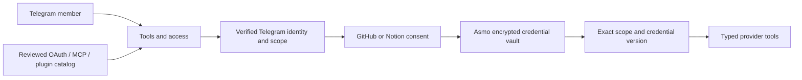
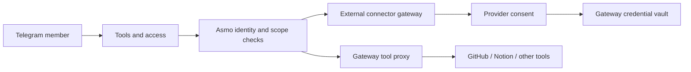

# Connector design and operator setup

Asmo connects GitHub and Notion through their own consent screens. A team member does not paste tokens, installation IDs, URLs, or private keys into the Mini App. An operator registers each provider application once. Chat works without any configured connectors.

## Two designs considered

### Direct provider OAuth with a reviewed catalog

Asmo owns the OAuth callbacks, encrypted vault, lifecycle checks, and typed tool adapters. GitHub and Notion credentials stay on the Asmo server. Later providers can add reviewed catalog entries without changing account-linking UI conventions. MCP and plugins are unavailable catalog entries in this implementation. The catalog does not load arbitrary manifests, connect to user-supplied servers, or execute remote code.

### A connector gateway provider

A gateway could provide a larger initial catalog and maintain provider OAuth changes. It would also require a new vendor account, delegated credential custody, gateway authorization mapping, and another revocation path. Its tool proxy would still need Asmo's scope, approval, and effect-version checks. No gateway vendor or gateway account is configured here.

| Criterion | Direct provider design | Gateway design |
| --- | --- | --- |
| End-user action | Click Connect and approve provider consent | Click Connect and approve provider consent |
| Credential custody | Asmo operator | External gateway vendor |
| Initial catalog | Two implemented providers | Vendor-dependent |
| Required setup | GitHub App and Notion public connection | Gateway account and vendor configuration |
| Authorization control | Exact local scope and typed tools | Local scope plus remote mappings |
| Operating dependency | Provider APIs | Provider APIs and gateway API |

Chosen design: direct provider OAuth. Two provider adapters fit the current product without a new service dependency. Future catalog protocols remain explicit and disabled until their execution and permission rules exist.

## Scope rules

The [Claude Tag admin guide](https://academy.claude.com/tutorials/claude-tag-admin-guide) distinguishes shared team connections from personal connectors. It also describes access bundles and choosing the narrowest scope's credential. Asmo adopts a stricter initial rule: each group or DM has its own connection, with no inheritance or fallback. DM connections belong to the DM owner. Group managers and owners can manage shared connections; members can inspect redacted status.

An integration scope contains `workspaceId`, `scopeId`, `kind`, and `ownerId`. The vault binds credentials to the whole scope key. A group connection cannot service another group or a DM. A personal connection cannot service another person's task. The current implementation does not attach personal connections to public group requests or implement inherited access bundles.

Each scope has at most one connection per provider. The authorization hook in `src/app.ts` refreshes Telegram membership and checks the current store view. Account linking checks that authority before start, at callback, and again after the provider exchange. Tool dispatch checks the connection creator's current authority. This intentionally fails closed if that creator loses manager access. An operator must reconnect through a current manager to transfer responsibility.

Repository grants and Notion grants are separate typed records. Every prepared live effect binds `connectionId` and `connectionVersion`. The tool gateway rejects missing or changed identity before using a token. Reconnecting cannot silently grant an already queued effect access to a newer credential.

## Account linking

### GitHub

1. A verified group manager or DM owner selects Connect GitHub.
2. Asmo stores a random, hashed, ten-minute state bound to that actor, provider, and scope. GitHub opens the Asmo App installation screen.
3. GitHub redirects to the configured setup URL with the installation ID and state. Asmo consumes that state once. The installation ID is still untrusted at this point, and no connection is marked connected.
4. Asmo creates a fresh state and PKCE verifier. It redirects to GitHub's OAuth account picker.
5. GitHub sends an OAuth code and state to Asmo. Asmo consumes the state once and exchanges the code with the stored PKCE verifier.
6. Asmo checks the installation's app ID and suspension state through the app API. It uses the OAuth user token to enumerate repositories that this user can access in that installation.
7. Asmo mints an installation token restricted to that verified repository ID list. The list is limited to 500 repositories. The token requests Issues write and Metadata read permissions.
8. Asmo rechecks Telegram authority and the scope's linking epoch. It persists the encrypted tokens and redacted connection record, then the server installs repository grants for that exact connection version.

The app token acts as Asmo's GitHub App. Issue creation still requires the existing task approval. OAuth user access proves the setup actor can access the installation's selected repositories; the installation ID by itself proves nothing. GitHub documents the [user OAuth flow and PKCE](https://docs.github.com/en/apps/creating-github-apps/authenticating-with-a-github-app/generating-a-user-access-token-for-a-github-app), [user-accessible installation repositories](https://docs.github.com/en/rest/apps/installations#list-repositories-accessible-to-the-user-access-token), and [restricted installation tokens](https://docs.github.com/en/apps/creating-github-apps/authenticating-with-a-github-app/generating-an-installation-access-token-for-a-github-app).

Installation tokens refresh before expiry. Refresh rechecks user-accessible repositories and does not widen the saved list. Expired user tokens rotate with their refresh tokens. App JWTs use RS256 and a lifetime below ten minutes. Failed refresh erases the local credential and marks the connection `needs_reconnect`. See GitHub's [JWT requirements](https://docs.github.com/en/apps/creating-github-apps/authenticating-with-a-github-app/generating-a-json-web-token-jwt-for-a-github-app) and [refresh-token guide](https://docs.github.com/en/apps/creating-github-apps/authenticating-with-a-github-app/refreshing-user-access-tokens).

### Notion

1. A verified manager or DM owner selects Connect Notion.
2. Notion's public OAuth screen lets that person choose a workspace and pages. Selecting a parent page can grant its child pages too.
3. Asmo consumes the bound state once and exchanges the code on the server with HTTP Basic client authentication.
4. Asmo saves the encrypted access and refresh token pair, bot ID, and Notion workspace ID. The browser receives only account name, scope, status, and a description of the provider-selected pages.
5. Notion search uses the API's page filter and returns at most 100 title matches. Page reading retrieves page metadata and at most 100 direct blocks. Nested blocks, attachment downloads, and linked pages are excluded. Receipts state those limits.
6. A 401 read response triggers one token-pair rotation and one retry. Refresh verifies the same bot and workspace. Failed refresh requires reconnection. Every request rechecks the local credential version; disconnect blocks the retry.

Only the provider's selected-page grant can authorize a page read. Asmo sends page IDs to fixed Notion endpoints and does not fetch URLs embedded in page content. It pins `Notion-Version: 2026-03-11`. See Notion's [authorization guide](https://developers.notion.com/guides/get-started/authorization), [title search](https://developers.notion.com/reference/post-search), [page retrieval](https://developers.notion.com/reference/retrieve-a-page), and [block-children retrieval](https://developers.notion.com/reference/get-block-children).

## Operator setup

These steps belong to the deployment operator. Users only approve provider consent.

1. Choose a public HTTPS origin for Asmo and expose its connector callback routes through the deployment. HTTP callbacks are allowed only for loopback development.
2. Generate a 32-byte vault key with `openssl rand -base64 32`. Store it as `ASMO_CONNECTOR_VAULT_KEY` in the deployment's secret configuration. Keep the key separate from SQLite and its backups. Losing it requires users to reconnect. Do not change it without a credential migration.
3. Register an Asmo GitHub App with Metadata read and Issues write permissions. Choose application visibility appropriate for the organizations that will install it. Enable expiring user access tokens. Set both its setup URL and OAuth callback URL to `https://YOUR_ASMO_HOST/connectors/github/callback`. Disable "Request user authorization (OAuth) during installation" because Asmo starts an explicit PKCE OAuth step after installation.
4. Generate the GitHub App's private key and client secret. Set all GitHub variables in the table below. The private key accepts a PEM string with real newlines or literal `\n` separators.
5. Create a Notion public connection with Read content capability. Disable insert and update capabilities for this read-only connector. Add `https://YOUR_ASMO_HOST/connectors/notion/callback` as its redirect URI. Set all Notion variables below.
6. Restart Asmo and open the desired Telegram scope's Tools and access page. Configured providers show Connect. Unconfigured providers show setup required.
7. Have a current group manager or DM owner complete the login and resource selection. Confirm the saved account and resources before asking Asmo to use the tools.

| Environment variable | Purpose |
| --- | --- |
| `ASMO_CONNECTOR_VAULT_KEY` | Base64 encoding of exactly 32 random bytes |
| `ASMO_GITHUB_APP_ID` | Numeric app ID, distinct from client ID |
| `ASMO_GITHUB_CLIENT_ID` | GitHub App OAuth client ID |
| `ASMO_GITHUB_CLIENT_SECRET` | GitHub App OAuth client secret |
| `ASMO_GITHUB_PRIVATE_KEY` | GitHub App RSA private key PEM |
| `ASMO_GITHUB_APP_SLUG` | App URL slug, such as `asmo-tag` |
| `ASMO_GITHUB_CALLBACK_URL` | Exact public callback URL |
| `ASMO_NOTION_CLIENT_ID` | Notion public connection client ID |
| `ASMO_NOTION_CLIENT_SECRET` | Notion public connection OAuth secret |
| `ASMO_NOTION_CALLBACK_URL` | Exact public callback URL |

Partial provider configuration fails startup. No account-linking endpoint accepts operator secrets. Fixture mode disables live linking and reports setup-required entries instead of simulated successful connections.

## Credential storage and disconnection

`src/integrations/index.ts` stores AES-256-GCM ciphertext in the same SQLite file as tasks. Every ciphertext authenticates its connection ID and credential version, or OAuth state hash, as additional authenticated data. OAuth state values are hashed in SQLite; PKCE verifiers are encrypted. Consumed state records erase their encrypted verifier. The module uses its own `asmo_integration_schema` version table and does not change the task schema's `PRAGMA user_version`.

All runtime integration SQL operations share the task store's per-file transaction gate. Provider HTTP calls occur outside transactions. Connector startup migration runs before worker/server operations. This avoids a synchronous SQLite lock wait blocking a task transaction's awaited commit in the same Node process.

API connection views exclude access tokens, refresh tokens, PKCE verifiers, client secrets, and private keys. Credentials go directly from the vault into provider HTTP adapters. They are never tool results, model input, Mini App state, or sandbox environment values. Provider error bodies are not forwarded. Requests use fixed HTTPS hosts, reject redirects, time out after 15 seconds, and stop reading responses after 2 MB.

Disconnect first fences the scope's tool grants, then increments the connection credential version and linking epoch. It erases credential ciphertext, clears selected-resource metadata, and consumes pending OAuth states. An exchange already in flight cannot reattach the connection after that epoch changes. A previously queued effect cannot use a disconnected or reconnected credential. A request already sent to a provider cannot be recalled; existing unknown-write reconciliation rules still apply.

Disconnect removes Asmo's local access. It does not uninstall the GitHub App or remove the Notion connection from the provider account. Users can revoke those in provider settings. Provider webhook revocation processing and automated app uninstall are not implemented. Shared connections currently depend on the setup manager's continued Asmo authority. No fallback credential can bypass that check.

## Verification

`tests/integrations.test.ts` exercises mocked provider HTTPS responses without real credentials or provider writes. It covers invalid, expired, denied, wrong-provider, and replayed state; current authority and private-owner checks; encrypted persistence and restart; installation ownership proof; selected-repository token limits; disconnect while exchange is in flight; queued credential-version fencing; GitHub and Notion refresh; the shared SQLite gate; Notion receipt privacy; fixed hosts; oversized responses; and provider page-grant rejection.

These checks establish local protocol and authorization behavior. They do not establish that a deployed callback origin, registered GitHub App, or registered Notion connection works with real accounts. A live smoke test requires the operator registrations above and a consenting test account.

Deployment limit: run one active application/connector worker process. The in-process refresh map coalesces requests in that process only. Multiple active processes sharing rotating OAuth credentials require database-level refresh coordination before deployment.
