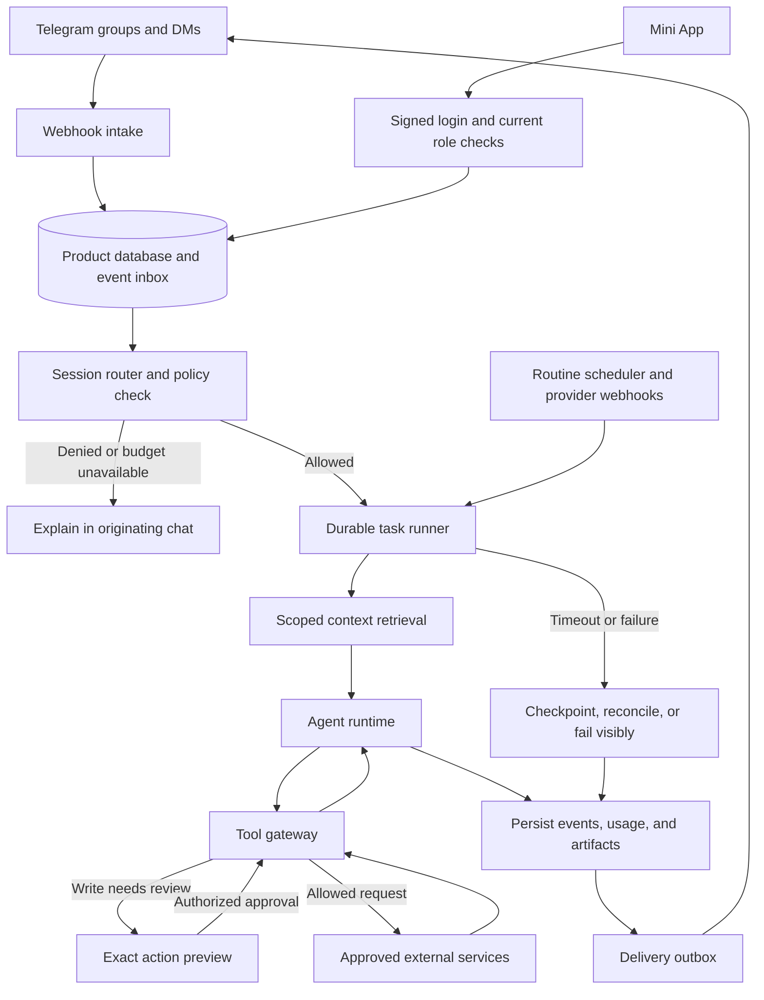
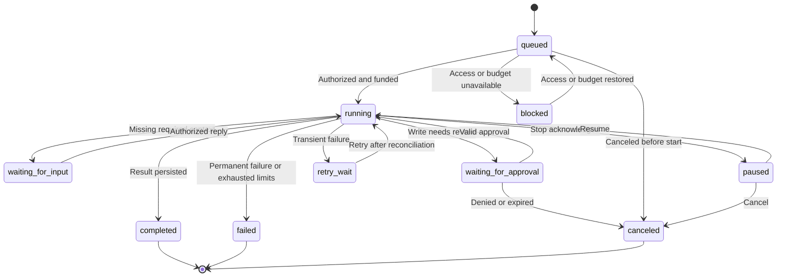

# Claude Tag for Telegram: research and build plan

Research checked on October 5, 2026. This document describes a proposed independent product. It does not claim affiliation with Anthropic or access to Claude Tag's private implementation.

## 1. Recommendation and assumptions

Build a shared agent for Telegram teams. A member tags the bot with work, the bot uses the team's approved context and tools, and everyone can follow or steer the task. Keep the conversation, result, memory, and scheduled follow-up connected.

The first complete workflow should be: a team discusses a bug, tags the bot, gets an investigation with sources, creates a ticket, optionally gets a tested draft PR, and receives an update when the issue changes. This tests the main product mechanisms in one useful workflow.

Planning assumptions:

- First customers are product and engineering teams with 5 to 30 people using Telegram groups.
- This is a hosted product with multiple customer workspaces. A single-team deployment uses the same design with less onboarding and billing work.
- Claude supplies the initial models. The product owns Telegram integration, authorization, task routing, memory rules, and billing.
- The default is an installed group bot with explicit member notices. Proactive replies are off until enabled by a group manager.
- Use one product identity with a working name such as `@TeamAgentBot`. Final name and username availability are unresolved.
- Two experienced engineers build the pilot. Time and operating-cost figures below are estimates, not quotes or measured results.

Match observable behavior. Exact reproduction of Anthropic's undisclosed models, internal prompts, infrastructure, and evaluation methods is not possible from public documentation.

## 2. What Claude Tag actually is

Anthropic launched Claude Tag on June 23, 2026. It is a shared team agent, with channel context, tools, memory, asynchronous work, and optional ambient behavior. The launch named Opus 4.8. Current model documentation allows organization-approved Opus and Sonnet choices, so the launch model should not be treated as a permanent requirement. [Launch announcement](https://www.anthropic.com/news/introducing-claude-tag), [current model controls](https://claude.com/docs/claude-tag/users/models).

The Help Center says the earlier Claude in Slack experience switched to Claude Tag on August 3, 2026. The current product is in beta for Team and Enterprise customers. It has channel mentions, private DMs, and Slack's assistant panel. These are different interaction and permission contexts. [Current product and migration](https://support.claude.com/en/articles/15594475-what-is-claude-tag).

For a substantial request, Claude Tag creates a session associated with the Slack thread and works in an isolated, temporary cloud sandbox. It updates a checklist, accepts steering from other channel members, and returns artifacts. Conversation state survives release of the working sandbox. A later turn can resume in a fresh sandbox. Existing-thread context is a window, not guaranteed complete history. [Session behavior](https://claude.com/docs/claude-tag/concepts/how-it-works).

Memory has channel notes and workspace notes. Public-channel work can save workspace notes; private-channel work reads those notes but writes to its own channel store. Group DMs and one-to-one DMs have separate notes. Members can ask what it remembers and correct entries. Memory is curated information, separate from session transcripts. [Memory rules](https://claude.com/docs/claude-tag/users/memory).

Routines can run on schedules, watch channels, or follow repository events. They use the channel's access, can be managed through conversation, and may outlive the person who created them. Automatic responses can be controlled separately. [Routines](https://claude.com/docs/claude-tag/users/proactivity), [response controls](https://claude.com/docs/claude-tag/users/when-claude-responds).

Channel work uses the agent's service accounts. Administrators assign tools and access by scope. Credentials can be injected at the network boundary rather than exposed inside the sandbox. This makes the shared agent a distinct actor in external tools. [Agent identity](https://claude.com/blog/agent-identity-access-model), [security and data handling](https://claude.com/docs/claude-tag/concepts/security-and-data).

Organization and channel budgets govern channel work. Connected users' one-to-one DMs normally bill to their seats; certain unconnected-user DMs can bill to the organization. The documentation does not publish a universal cost per task. Activity review covers routines, memory, and network events, while external services retain their own action logs. [Billing](https://claude.com/docs/claude-tag/admins/set-spend-limit), [audit](https://claude.com/docs/claude-tag/admins/audit).

Fixed commands include `!help`, `!configure`, `!restart`, `!status`, `!mute`, `!unmute`, `!fast`, `!feedback`, `!routines`, and `!fork`, subject to workspace availability. [Command reference](https://claude.com/docs/claude-tag/users/commands).

Public limitations matter. Claude Tag cannot be rebranded in Slack or deployed as the same product through third parties. Channel work has no per-user spend caps. Slack Connect channels are unsupported. These are limitations of Claude Tag, not requirements for our version. [Access controls and unavailable controls](https://claude.com/docs/claude-tag/admins/restrict-access).

The current product page demonstrates analytics, catch-up, meeting preparation, monitoring, and draft PR workflows. Treat these as supported use-case directions, not evidence that any arbitrary task succeeds without configured tools. [Product examples](https://claude.com/product/tag).

## 3. Feature mapping

Everything in the Telegram column is a proposed implementation unless marked as a platform constraint.

| Claude Tag behavior | Telegram implementation | Delivery stage |
| --- | --- | --- |
| Tag an agent in a team conversation | Installed bot mention, command, or reply to its task message | Core pilot |
| Shared work that anyone can continue | Task session belongs to a group; eligible members can add context or steer it | Core pilot |
| Read relevant conversation context | Store permitted updates, reply relationships, topic messages, and approved imports | Core pilot |
| Show work and progress | One editable task message with stages and Stop/Resume controls | Core pilot |
| Keep useful context across tasks | Group memory with evidence, corrections, and retention rules | Core pilot |
| Use team tools under an agent identity | Scoped service accounts through a policy-enforcing tool gateway | Core pilot |
| Return answers, documents, charts, and code work | Chat answer, document upload, source links, ticket links, draft PR links | Core pilot, code in beta |
| Run in the background | Durable task records and resumable runtime sessions | Core pilot |
| Run recurring work | Parsed schedules plus durable triggers and pause controls | Core pilot |
| Speak proactively | Opt-in triggers, usefulness filtering, cooldowns, and notification budgets | Expanded beta |
| Personal DMs | Separate user context and personal connectors | Read-only DMs in pilot; connectors later |
| Channel configuration | Mini App for group settings, tools, budgets, memory, routines, and audit | Core pilot |
| Fork or restart a conversation | New session with an authorized context snapshot; restart preserves prior audit | Expanded beta |
| Slack assistant panel | Telegram Main Mini App and bot menu; platform-specific replacement | Core pilot |
| Workspace-wide public search | Search only ingested sources approved for that workspace | Deliberate platform gap |

Group topics should help organize work, but do not require every team to convert its group into a forum. A normal group must support the full basic workflow.

## 4. Telegram facts that change the design

The current Bot API reference inspected for this research lists version 10.3 dated August 24, 2026. It provides group/topic routing, callbacks, edited-message updates, webhook authentication, and private-chat draft streaming. It has no general method to fetch arbitrary old group history, and normal group deletions lack a general deletion update. Pending updates are retained for no more than 24 hours. Some business-account behavior differs. [Bot API](https://core.telegram.org/bots/api).

Privacy-enabled group bots receive a restricted set of messages. Reading ordinary group conversation requires an appropriate bot-admin setup or disabled Group Privacy Mode. Changing that privacy setting requires re-adding the bot. Recent features include guest mentions without installation, private ephemeral responses within groups, rich messages, private-chat topics, and opt-in bot-to-bot communication. Guest mode only provides the summoning context and possible replied-to message; it does not give history or ongoing observation. The older FAQ's absolute bot-to-bot prohibition conflicts with the newer feature documentation. Use the newer documented exceptions and test them. [Privacy and recent bot features](https://core.telegram.org/bots/features), [older FAQ](https://core.telegram.org/bots/faq).

Mini App authentication must validate Telegram's signed `initData` on the backend. Client-side `initDataUnsafe` and `chat_instance` are not authority to manage a group. [Mini App authentication](https://core.telegram.org/bots/webapps#validating-data-received-via-the-mini-app).

Membership verification also needs care: `getChatMember` is only guaranteed for other users when the bot is an administrator. [Membership lookup](https://core.telegram.org/bots/api#getchatmember).

Digital services sold inside Telegram bots or Mini Apps must use Telegram Stars. Payment support must follow the documented invoice, payment, refund, and support flow. [Digital payments](https://core.telegram.org/bots/payments-stars).

Telegram distinguishes cloud chats from end-to-end encrypted Secret Chats. Do not describe this group-bot product as end-to-end encrypted. [Telegram chat encryption](https://telegram.org/faq#q-how-are-secret-chats-different).

Design consequences:

1. Track `context_available_from` and ingestion gaps per group. Show them when a question depends on older history.
2. Offer admin-uploaded Telegram Desktop exports as a controlled import. Do not silently log into a user's account to fetch history.
3. Separate observation from response mode. A bot may receive messages while configured to answer only mentions. Tell members what the backend stores.
4. Use guest mode as a lightweight trial with general capabilities. Never attach a customer's team credentials or private memory to an unverified guest chat.
5. Deliver long-running work through an installed bot. Guest interactions are too limited for the complete shared-agent experience.
6. Treat group topics as conversation routing, not automatic private security boundaries. Restrict sensitive work to a separate group or DM.
7. Maintain an application-level delete/forget mechanism. Never promise that deleting a Telegram message deletes every stored copy.
8. Keep basic text and inline-button rendering available. Verify newer rich and ephemeral behavior on supported clients before depending on it.

## 5. Product experience

### Setup

1. The owner starts the bot in a DM and creates a workspace.
2. The owner adds it to a selected group using a one-time deep link.
3. The backend verifies the actor's current group authority and binds the group to the workspace. One group cannot join two tenants.
4. Setup shows the required reading mode, retention period, allowed users, and a member notice. Collection starts only after activation.
5. The owner opens the Main Mini App from a DM or a supported deep link. Group IDs in links are hints; server-side binding and authorization decide access.
6. The owner connects one tool, grants named resources and actions, and sets a budget.
7. The bot posts a test response identifying enabled capabilities and the context start date.

For managed team groups in the pilot, require the minimum bot-admin setup needed for reliable membership checks. Avoid delete, ban, and unrelated management rights. A non-admin demo must not receive sensitive team connectors when the backend cannot establish its audience and approvers. Resolve and test the exact Telegram rights during the week-one prototype.

The BotFather privacy setting is bot-wide. An application-level limited mode filters what we store, but cannot make the platform deliver fewer messages for just one group when global privacy is disabled. Do not mislabel filtering as platform-level privacy.

### A group task

Example messages below are original product examples.

```text
Maya: Checkout fails when a customer applies two coupons.
Sam: Screenshot attached. This started after today's deploy.
Maya: @TeamAgentBot investigate this and create a bug ticket.

Bot: Task T-184 started.
     1. Read the report
     2. Check the linked deploy and logs
     3. Draft a ticket
     [Stop] [Details]

Sam, replying to the task message: Only check the EU deployment.

Bot: Draft ready for the engineering project.
     Includes reproduction steps, evidence, and an owner suggestion.
     [Create ticket] [Revise] [Cancel]

Maya: [Create ticket]

Bot: Created ENG-284. Evidence and task details linked.
     [Investigate a fix] [Watch this ticket]
```

The confirmation is a pilot policy for a first connector write, not an unavoidable step for every action. A manager can authorize a narrow class of routine writes once, with resource and spending limits.

### Follow-up and concurrent tasks

- Replies to a task message continue its session, even from a different eligible teammate.
- A fresh mention without a task association starts a new task. It does not redirect whichever job ran most recently.
- In a topic, replies to task messages remain task-specific. Other topic messages become relevant context, not automatic instructions for every active job.
- For ambiguous input, the bot presents the active task choices. It never guesses when a guess could change an external action.
- If two members give conflicting instructions, serialize the steering events and pause before an affected write. Show the conflict and apply the group's decision rules.
- Stop cancels pending work and blocks new tool dispatch. It cannot undo a ticket or commit already created. Show completed effects and any operation still in flight.
- Resume continues saved task state. Restart creates a new session using a fresh authorized context snapshot.

### DMs and private group replies

Read-only DMs launch early, with user-owned memory. Team data is accessible only after verified workspace membership and authorization for the specific source. Personal connector results stay private unless the user explicitly chooses to share an approved result.

Ephemeral group replies can show private details or configuration prompts where supported. They are a display mechanism, not a substitute for server-side authorization. Keep a DM route available.

### Minimal commands

| Command | Behavior |
| --- | --- |
| `/start`, `/help` | Setup and supported actions |
| `/settings` | Open settings through an authorized link |
| `/status T-184` | Show task state |
| `/stop T-184`, `/resume T-184` | Stop or resume a task |
| `/memory` | Inspect and correct authorized memory |
| `/routines` | List, pause, or edit group routines |
| `/forget` | Start a scoped deletion workflow |

Natural-language requests remain the primary interface. Parse administrative commands deterministically. Do not use a model to decide whether an unauthorized user may change settings.

## 6. Recommended technical architecture

Use a TypeScript application with grammY for Telegram, PostgreSQL for product records, object storage for files, a small React Mini App, and a policy-enforcing tool gateway. grammY is a Telegram bot framework. pgvector supports vector search inside PostgreSQL; add it when semantic retrieval beats plain full-text search in evaluation. [grammY](https://grammy.dev/), [pgvector](https://github.com/pgvector/pgvector).

Use PostgreSQL row security as an additional tenant boundary. The application still checks authorization, and the production database role must not accidentally bypass row policies. [PostgreSQL row security](https://www.postgresql.org/docs/current/ddl-rowsecurity.html).

### Choose the agent runtime after a short implementation trial

Anthropic's Managed Agents is a beta API with agent definitions, environments, durable sessions, event streams, steering, and built-in tools. It can run managed or self-hosted environments. The Agent SDK embeds Claude Code's agent capabilities in a process you operate. These are available building blocks, not APIs that provision the Claude Tag product itself. [Managed Agents](https://platform.claude.com/docs/en/managed-agents/overview), [Agent SDK](https://code.claude.com/docs/en/agent-sdk/overview).

| Option | Product advantage | Cost or risk | Decision |
| --- | --- | --- | --- |
| Managed Agents | Fast route to sandboxed, resumable agent work | Beta dependency; vendor data lifecycle; tool policy and event behavior need testing | Default pilot candidate |
| Agent SDK in isolated workers | More runtime control and an existing agent engine | We operate sandboxes, session persistence, recovery, and upgrades | Fallback when managed runtime fails a requirement |
| Direct Messages API with our own loop | Explicit control for a narrow Q&A or tool workflow | More engineering to match long tasks, code execution, and resumability | Useful for inexpensive simple answers |

Spend two days comparing managed sessions against an SDK proof of concept. Use the same task, permission boundary, cancellation, and restart tests. Select one primary agent engine. Keep a narrow adapter so we can migrate; do not build all engines into the pilot.

Managed permission policies can allow, ask, or evaluate server-executed tools. Custom tools are controlled by our application. Use application-owned write tools through the gateway wherever exact authorization and action previews matter. Managed `auto` evaluation is not a human approval checkpoint. [Permission policies](https://platform.claude.com/docs/en/managed-agents/permission-policies).

A durable job runner handles incoming work, schedules, provider events, and delivery retries. Managed Agents can handle agent session persistence; we still need durable product bookkeeping. For an SDK deployment with complicated waits and resumptions, Temporal is a reasonable option. It must not duplicate the agent's whole event history or hold provider calls inside replayed workflow code. [Temporal workflow execution](https://docs.temporal.io/workflow-execution), [TypeScript guide](https://docs.temporal.io/develop/typescript).

### System diagram



This is the proposed system, not a diagram of Anthropic's private implementation.

### Runtime responsibilities

1. Intake validates the webhook secret and stores a unique bot/update record before acknowledging delivery.
2. A worker normalizes messages, replies, topics, files, edits, membership events, and callbacks.
3. The router resolves workspace, group, task, actor, and permissions. It associates each bot progress/result message with its task.
4. The policy engine calculates permitted resources, output destination, action classes, model choice, and remaining budget.
5. Retrieval assembles an authorized context bundle with source IDs and ingestion gaps.
6. The task runner creates or resumes the runtime session. It forwards eligible steering events in order.
7. The tool gateway enforces each call, independent of what the agent says its permissions are.
8. Persist state changes, artifact references, and usage. Deliver messages through an outbox with bounded retries.
9. On completion, update the task card, post a concise result, and retain only approved memory.

Use real process or provider isolation for code execution. A queue consumer with a different directory is not an adequate sandbox.

## 7. Context and memory specification

Maintain five separate stores:

| Store | Purpose | Example |
| --- | --- | --- |
| Raw permitted messages | Evidence and retrieval | A bug report with message ID |
| Task transcript and events | Resume and audit | Tool call, result, teammate correction |
| Group memory | Stable team facts | Repository, issue project, report format |
| Workspace knowledge explicitly shared | Approved cross-group facts | Organization-wide release process |
| User DM memory | Private personal context | User preferences and private requests |

Default every Telegram group to private in product policy, even if its Telegram username is public. A workspace owner must explicitly mark which material is shared. Telegram public visibility does not prove consent to combine conversations.

Retrieval order:

1. Resolve destination and permitted source set.
2. Load the current task and relevant reply chain.
3. Load recent messages from the same group and topic within a bounded window.
4. Retrieve relevant facts and older records using metadata filters and full-text search.
5. Use semantic search if the task evaluation shows a benefit. Filter scope before ranking; never retrieve every tenant and ask the model to ignore the wrong records.
6. Retrieve approved tool results with resource restrictions.
7. Compact long context with source IDs. Preserve open questions, conflicts, and important corrections.
8. Include collection dates and missing periods. If evidence is absent, say so or request a source.

A proposed initial context allocation is 50% current task, 25% relevant prior context, 15% memory and instructions, and 10% tool overhead. These are starting limits for measurement, not model requirements.

Every memory entry should have scope, content, evidence references, author type, creation time, last validation time, sensitivity, and optional expiry. Automatic entries begin as candidates. Explicit stable facts can be saved directly under the configured policy. Delete conflicting duplicates and show revisions.

Instruction precedence must be deterministic: platform safety and product policy, workspace policy, group policy, current authorized task instructions, then informational memory and retrieved content. Memory cannot grant a tool permission or turn a quoted instruction into an administrative command.

For imports, accept a supported export format, show date range and message count, let the admin inspect the material, then assign one scope. Deduplicate by original IDs when available. Do not create new memberships from imported names. Imported data cannot make an inaccessible Telegram link a live source; keep an authorized imported-record view instead.

Deletion removes or invalidates linked summaries, embeddings, memory, cached retrieval, uploaded files, and runtime copies where supported. Keep non-content audit metadata where required by our stated retention policy. Define backup expiry separately. Cancel queued runs and isolate active sessions before a deletion can be declared complete.

## 8. Identity, tools, and authorization

Shared channel work should use a distinct service identity. Prefer a GitHub App with selected repositories over a developer's broad personal token. GitHub Apps support installation-specific permissions and tokens. [GitHub Apps](https://docs.github.com/en/apps/creating-github-apps/about-creating-github-apps/about-creating-github-apps).

| Role | Can do |
| --- | --- |
| Workspace owner | Bind groups, manage billing, assign roles, define workspace policies |
| Group manager | Configure assigned groups, approve connectors and actions within owner policy |
| Member | Ask, steer authorized tasks, inspect group memory, use allowed tools |
| Guest or unverified actor | General assistance or explicitly limited group actions; no private tools by default |
| Agent service identity | Only the named resources and operations granted to its task scope |

Evaluate both the group's capability and the actor's product role. In a shared group, a result must be safe for the whole group audience, not only for the requester. A connector with private files needs a shared-resource allowlist; a user's personal access does not imply group sharing permission.

Each tool registration includes name, input schema, read/write classification, resources, allowed destinations, credential reference, timeout, maximum result size, approval policy, and idempotency behavior.

Pilot action rules:

- Reading permitted messages and approved read-only connectors runs automatically after installation authorization.
- Drafting a document or ticket preview runs automatically.
- A new connector's first write requires a concrete preview and approval. A manager can later authorize bounded routine writes.
- Draft PR creation can be authorized per repository. Merge, production deployment, destructive deletion, and payments require separate policies and explicit task authorization.
- Personal connector outputs remain in the user's private context until an explicit authorized sharing action.

For approval, store a canonical action hash, requester, authorized approver, resource, destination, expiry, and policy version. The button carries a random identifier, not trusted action JSON. The backend checks the callback actor and current permissions, consumes the approval once, and verifies that the proposed action still matches the preview.

If the draft changes, invalidate the old approval. If access is revoked while waiting, deny the write. If an anonymous administrator or `sender_chat` sends a sensitive request, require an identified authorized person to approve it.

Keep tool secrets outside model prompts, task transcripts, ordinary logs, and code sandboxes. A gateway should attach narrowly scoped credentials only for approved requests. Managed vaults can hold MCP credentials or opaque environment-variable placeholders, but their availability and boundaries do not replace our tenant checks. [Managed vaults](https://platform.claude.com/docs/en/managed-agents/vaults).

Test prompt injection as a normal failure case. A web page, file, repository issue, or imported chat may tell the agent to copy secrets, change policies, or post elsewhere. These are untrusted data. Enforce resource, network, and destination limits outside the model.

## 9. Initial connectors and execution

Launch with Telegram context and file understanding plus one external write workflow. Prefer GitHub and the pilot team's existing issue tracker. Do not ship a connector marketplace before a reliable end-to-end task exists.

Connector order:

1. GitHub read access, repository metadata, issues, and pull requests.
2. One issue tracker, selected after recruiting pilot teams. Restrict to named projects.
3. Uploaded runbooks and documents. Add a document-service connector only when pilots need it.
4. Read-only observability through a narrow API or approved queries.
5. Data/CRM connectors for the next customer segment, after engineering usage is validated.

Each connector must support installation, resource selection, permission checks, a test query, revocation, token refresh if relevant, sanitized errors, and action audit. A tool that fails halfway through a write must support reconciliation before retry.

Coding workflow:

1. Clone the approved repository and record its base commit.
2. Read repository instructions and relevant task evidence.
3. Reproduce the issue or report why reproduction failed.
4. Edit on a task-specific branch inside an isolated environment.
5. Run the relevant checks in the repository. List checks that could not run.
6. Produce a diff and a concise result.
7. Open a draft PR through the approved agent identity, with a link back to the product task.
8. Preserve branch protection and human review. Do not treat a passing test as authorization to merge.

Use egress restrictions and short-lived credentials. Treat dependency-install scripts and repository tests as untrusted code. Do not expose other customers' files, host mounts, or production tokens to the sandbox.

## 10. Durable tasks and proactive behavior

Task states:



Store model/runtime version, session ID, context snapshot reference, policy version, cost ledger, steering cursor, and completed effects. Add a `stopping` operational flag while a runtime cancellation is in progress; only show `paused` after acknowledgement or a stated timeout.

Long tasks sleep between events. Do not keep an LLM call or sandbox running merely to wait until tomorrow. Persist the next trigger and resume a session or task when it occurs.

Routine record:

```text
Routine
  workspace_id, group_id, optional topic_id
  instruction, approved sources, allowed action classes
  trigger: schedule | source_event | bounded_watch
  timezone, next_run_at, owner_role
  output_destination, change_only, quiet_hours
  run_budget, notification_budget, policy_version
  status: proposed | active | paused | revoked
```

Use an IANA timezone. Confirm the interpreted schedule and next occurrence in plain language before activating an ambiguous request. Persist timezone rules, not a fixed offset; support daylight-saving changes for customers who use them. Asia/Tashkent is only the default for this planning session, not a universal product setting.

Standing work belongs to the group. If its creator leaves, keep it only under a manager-approved ownership policy. Personal routines stop when their user access is revoked. Always recheck tool access, group membership, destination, and budget at execution time.

Proactive triggers should be concrete: an assigned task exceeded its deadline, a watched issue changed, an alert crossed a configured threshold, or a requested approval has not arrived. Begin with these events. Broad ambient reading comes later.

For ambient behavior, batch candidate messages, use cheap rules first, then a bounded classification call if needed. Start an expensive agent session only when the candidate is useful. Deduplicate events, apply per-topic cooldowns, respect quiet hours, and cap notices per group. Default proposal: at most three unsolicited notices per group per day, adjustable by managers. This is a product choice, not a Telegram limit.

Include “Why this appeared” and “Mute this watch” controls. Run ambient decisions in shadow mode before enabling posts. Measure false interruptions, missed important events, and user mutes.

## 11. Data model and interfaces

Proposed core tables:

| Table | Required records or fields |
| --- | --- |
| `workspaces` | Owner, plan, policy version, budget, retention |
| `users`, `memberships` | Telegram user ID, workspace role, status |
| `chat_bindings` | Bot ID, chat ID, workspace ID, verified binding, context start, collection mode |
| `messages`, `message_versions` | Scoped source, author, text/file refs, timestamps, reply/topic relationships |
| `ingestion_gaps` | Group, unavailable period, known cause |
| `tasks` | State, session ID, scope, requester, budget, runtime metadata |
| `task_events` | Ordered steering, tool calls, tool results, effects, errors |
| `message_task_links` | Telegram message to task association |
| `memories`, `memory_sources` | Scope, content, evidence, revision, validity |
| `connectors`, `resource_grants` | Service identity reference, allowed resources and actions |
| `approvals` | Action hash, actor, policy version, expiry, single-use state |
| `routines`, `routine_runs` | Trigger, schedule, scope, cursor, output, status |
| `artifacts` | Scoped object key, format, source references, expiry |
| `usage_ledger`, `budget_reservations` | Model/tool/runtime usage, reservations, reconciliation |
| `event_inbox`, `delivery_outbox` | Dedupe keys, retry state, delivery receipts |
| `audit_events`, `deletion_jobs` | Administrative actions and deletion progress |

Use 64-bit-safe identifiers and composite keys containing bot/workspace/chat scope. Never use usernames as stable identity. Preserve group-to-supergroup migration mappings. `chat_instance` is not a substitute for a verified `chat_id` binding.

Suggested internal operations:

```text
POST /telegram/webhook/:botId
POST /auth/telegram-miniapp
POST /workspaces/:id/chats/:chatId/activate
GET  /tasks/:id
POST /tasks/:id/steering
POST /tasks/:id/stop
POST /approvals/:id/decision
GET  /chats/:id/memory
POST /chats/:id/routines
POST /connectors/:id/test
POST /scopes/:id/deletion
```

These are suggested application routes, not Telegram methods. Each operation resolves its own authority server-side.

## 12. Reliability and failure behavior

| Failure | Required response |
| --- | --- |
| Duplicate incoming update | Persist once; do not create a second task or external write |
| Out-of-order edits or steering | Preserve versions; serialize per task; prevent stale overwrites |
| Worker crash | Resume from checkpoint and reconcile uncertain effects |
| Runtime event stream disconnect | Reconnect from durable cursor; deduplicate repeated events |
| Connector timeout after possible write | Check provider state before retry; mark unknown effect when reconciliation fails |
| Telegram send timeout after possible delivery | Avoid claiming exactly-once delivery; reconcile where possible and tolerate an occasional duplicate notice |
| Telegram or model rate limit | Respect retry guidance, queue work fairly, and show delayed state |
| Bot removed or destination inaccessible | Stop collection, pause routines, revoke output access, retain an owner-visible failure record |
| Connector revoked during a task | Stop new calls; invalidate pending approvals; show the missing capability |
| Budget runs out | Stop starting calls, preserve partial work, and show spent amount and remaining action |
| Group history missing | Show coverage gap; ask for the relevant message, file, or import |
| User leaves a private group | Block subsequent private-source access and invalidate stale approvals |
| Ordinary message deleted in Telegram | Do not infer a guaranteed deletion event; support explicit product deletion |
| File parsing fails or malicious content appears | Quarantine or reject; report the unavailable evidence |
| Model gives unsupported claims | Require evidence for retrieved facts and make missing sources visible |

Before a side effect, save its intent and an idempotency key. After it, save the provider's object ID. If the provider has no idempotency mechanism, use a correlation marker and a reconciliation read. Exactly-once external writes cannot be assumed across arbitrary APIs.

Keep delivery outbox processing separate from task completion. A successful task whose reply failed to post is complete with a delivery problem, not an invitation to execute the task again.

Proposed service targets: acknowledge accepted tasks within three seconds at the 95th percentile, recover queued work after a worker restart, and surface permanent failures without leaving a task marked running indefinitely. Set final reliability targets after the pilot establishes actual traffic and runtime behavior.

## 13. Models, costs, and pricing

Current documented base API prices are Sonnet 5.5 at $2 input/$10 output per million tokens, Opus 5.5 at $4/$20, and Haiku 4.5 at $1/$5. Managed Agents adds $0.08 per running session-hour. Web search is $10 per 1,000 searches. Recheck before implementation; availability and price can change. [API pricing](https://platform.claude.com/docs/en/about-claude/pricing).

Proposed routing: use the cheapest evaluated model for classification and simple answers; use Sonnet for ordinary tool work; use Opus when task evaluations justify the added cost. Pin tested model versions. Do not silently replace every customer's model when a new family version appears.

The table below is a simulated cost calculation, not measured Claude Tag cost. Token totals are cumulative across all calls in a task, including repeated context and reasoning output billed by the provider. Figures exclude cache effects, extra tools, embeddings, retries, storage, and support.

| Example | Assumed total tokens | Model | Model cost |
| --- | --- | --- | --- |
| Short context answer | 8,000 input + 1,000 output | Sonnet 5.5 | $0.026 |
| Investigation and ticket draft | 60,000 input + 8,000 output | Sonnet 5.5 | $0.200 |
| Coding task | 200,000 input + 30,000 output | Opus 5.5 | $1.400 |

If these take 0.5, 5, and 20 active minutes respectively on Managed Agents, the runtime additions are approximately $0.0007, $0.0067, and $0.0267. A workspace running 1,000 short answers, 100 investigations, and 20 coding tasks in a month would spend about $74 in model tokens and $1.87 in runtime under these assumptions. Heavy real-world sessions may cost much more.

Use this formula for measured operating cost:

```text
cost = uncached_input * input_rate
     + cache_writes * write_rate
     + cache_reads * read_rate
     + billed_output * output_rate
     + runtime_hours * runtime_rate
     + search_calls * search_rate
     + other_tools + storage + delivery + shared_infrastructure
```

Rates must be normalized to the same token units. Track every usage event and reconcile final billed totals. Reserve budget atomically before each call across workspace, group, and task limits. Bound concurrency and output tokens. Use provider-side limits as another control; delayed billing and in-flight work mean an application spend meter alone is not a perfect billing ceiling.

Avoid running a large model on every chat message. Batch observation, cache stable context, retrieve smaller evidence sets, and put daily maintenance on bounded jobs. Charge separately for heavy autonomous work.

Proposed commercial test, not a final price: a workspace subscription plus included usage and a metered overage cap. Test willingness to pay with actual pilot task results. Avoid unlimited coding, unlimited monitoring, and an unexplained per-message price.

For a small hosted pilot, allocate $150 to $500 per month for shared application infrastructure as an unquoted planning reserve, plus measured agent/tool usage. This excludes salaries, taxes, legal work, payment conversion, and support. Price service margin using net realized payment receipts rather than assuming a fixed USD value for each Star.

The first pilot can be free and budgeted. Before charging inside Telegram, implement Stars invoices, payment confirmation, duplicate-payment handling, refund support, and payment-related support. External business contracts require their own terms/platform review; do not assume an external checkout link can bypass Telegram's digital-service rules.

## 14. Build sequence and acceptance gates

An internal proof of concept can take one to two weeks. The following ten-week plan targets a usable pilot/beta with two experienced engineers. Full feature parity, enterprise hardening, many connectors, and broad autonomous execution require more work. A solo build should allow roughly 12 to 20 weeks for comparable scope, depending on experience and connector difficulty.

| Phase | Work | Acceptance gate |
| --- | --- | --- |
| Week 1 | Interview three pilot teams; inventory exact work; test Telegram modes and agent runtimes | Prove mentions, reply routing, mid-task steering, stop, and one isolated tool task |
| Week 2 | Build webhook intake, workspace/group binding, roles, event inbox, task records, outbox | Duplicate updates and unauthorized callbacks cannot cause duplicate work or writes |
| Week 3 | Implement scoped context, coverage dates, file parsing, citations, group and DM separation | Context answers cite permitted evidence; unrelated group and DM content never appears |
| Week 4 | Add one external connector, previews, approvals, budget reservations, Mini App setup | A member completes a discussion-to-ticket workflow with correct resource and actor audit |
| Week 5 | Add memory inspection/correction, schedules, resumability, revocation handling | A routine runs after a restart; revoked access blocks its next action |
| Week 6 | Run core pilot in three teams; repair reliability and usability problems | At least 50 real tasks assessed; no unresolved permission or duplicate-write defect |
| Weeks 7 to 8 | Add sandboxed code work, draft PRs, task resumption, provider event watches | A seeded bug becomes a draft PR with relevant checks and clear limitations |
| Week 9 | Run proactive shadow tests, add useful event triggers, implement deletion workflow | No cross-scope leaks; deleted sources stop retrieval; notification quality meets pilot gate |
| Week 10 | Add billing if needed, operate failure drills, document limits and support | Owners can control spend, revoke connectors, pause routines, and export audit records |

Engineering split: one engineer owns Telegram, product backend, Mini App, roles, and delivery. One owns runtime integration, retrieval, tool gateway, connectors, and task evaluation. Both review authorization and failure recovery.

If week-one runtime tests fail, switch to the SDK option and extend the schedule before expanding features. If pilot users mostly want general operations, swap the engineering connector order; keep the same session, permission, and durability work.

## 15. Test plan and release criteria

Build a versioned task evaluation set with original or consented data, expected outcomes, allowed sources, forbidden effects, and a human rubric. Start with 50 tasks drawn from pilot workflows, not only artificial prompt examples. Include malformed and adversarial cases separately.

| Test | Passing result |
| --- | --- |
| Tag halfway through a discussion | Uses captured relevant context and identifies unavailable older material |
| Two unrelated jobs in one group | Replies and tools remain associated with the correct task |
| Teammate steering during execution | Accepted instruction affects the next relevant step without restarting unrelated work |
| Emoji before a mention | Correct Telegram entity parsing; no string-offset bug |
| Group migrated to supergroup | Binding, active tasks, routines, and source references remain correct |
| Stop during a slow tool call | New dispatch stops; in-flight effects are disclosed |
| Crash after external write | Reconciliation finds the created item and avoids a second write |
| Repeated approval callback | The approval executes at most one authorized action |
| Different user taps approval | Policy rejects unauthorized actor without changing the task |
| Connector token revoked | Calls fail closed and scheduled work does not keep old access |
| Prompt injection in a file or tool result | No permission expansion, secret disclosure, or unauthorized destination |
| Engineering asks about private sales data | Retrieval and tool gateway reject the source before model output |
| User DM asks for someone else's history | No access to another user's private content |
| Source deleted through product controls | Dependent memory and retrieval disappear; affected active context is invalidated |
| Daily schedule after restart | One run for the scheduled occurrence; timezone shown correctly |
| Proactive watch with no meaningful change | No notice |
| Bot-to-bot alert loop | Dedupe, cooldown, and depth limits terminate it |
| New Telegram client feature unavailable | Plain text, buttons, or DM fallback remains usable |
| Flood or provider rate limit | Bounded retry without runaway cost or duplicate task execution |
| Budget almost exhausted | Concurrent jobs cannot each reserve the same remaining amount |

Proposed pilot gates:

- At least 80% of scoped evaluation tasks meet their expected outcome with a human reviewer.
- At least 95% of evidence-based material claims in sampled answers have supporting, accessible sources.
- Zero cross-tenant or private-context disclosures in the release test set.
- Zero unauthorized writes and zero duplicate writes in the deliberate retry/crash tests.
- Owners can inspect and correct memory, stop tasks, pause routines, revoke access, and complete a deletion request.
- Proactive shadow review rates at least 80% of candidate notices useful; users can disable each watch. Keep posting off if this gate fails.
- Every incomplete task ends with an explicit state and actionable reason.

These are release targets, not measured results. A finite passing test set reduces risk; it does not prove the absence of all leaks or failures.

Track weekly active groups, completed delegated tasks, accepted artifacts, time to result, correction rate, interruptions per group, task cost percentiles, and teams returning in week four. Message count alone does not establish product value.

## 16. First implementation backlog

1. Write the observable behavior contract for mentions, replies, task routing, steering, stop, and output visibility.
2. Create a test bot and verify current API capabilities in a private test group and DMs.
3. Implement the managed-versus-SDK comparison with one scoped connector and approval.
4. Implement tenant and group binding before private context or credentials enter the system.
5. Add durable intake, task records, and reply-to-task links.
6. Complete one cited context answer with clear collection coverage.
7. Complete one ticket preview, authorized write, and audited result.
8. Make that workflow survive duplicate updates, worker crash, tool timeout, and cancellation.
9. Add memory correction and one daily digest with a pause control.
10. Run three teams through actual work before adding broad ambient behavior or more connectors.

Repository layout proposal:

```text
apps/api                 webhook and product API
apps/miniapp             settings, tasks, memory, routines, usage
workers/task-runner      session and scheduling integration
packages/telegram        update parsing, rendering, task routing
packages/policy          authorization and action decisions
packages/context         scoped retrieval and memory
packages/agent-runtime   selected runtime adapter
packages/tools           connector gateway and resource grants
packages/data            schema and tenant policies
evals                    task cases and failure fixtures
```

Keep these as modules in one deployable application initially. Extract services only when traffic, isolation, or operations require it.

## 17. Unknowns and decisions to validate

Public research verifies product behavior and documented platform interfaces. It does not reveal Claude Tag's internal prompts, exact context window sizes, routing model, ambient classifier, internal cost structure, or comprehensive success rates. Older marketing and integration pages describe the previous app and contain conflicting limits. Prefer current Tag documentation for Tag behavior.

We did not log into a live Claude Tag workspace or run a Telegram bot during this research. Platform behavior, SDK coverage for new API methods, client rendering, membership checks, reconnect semantics, payment behavior, and runtime cancellation require the week-one proof of concept. The architecture and diagrams are design proposals, not tested code.

Decisions for the first pilot are customer segment, first issue tracker, shared versus customer-specific bot identity, acceptable retention, hosted versus customer-operated execution, permitted write classes, and launch payment model. None blocks a behavior prototype. Production credentials and a Telegram bot token will be needed when implementation starts.

Recommended first release promise: “Tag our bot in your Telegram team group. It uses approved context, completes scoped work with visible progress, and brings results and follow-ups back to the group.” Ship that workflow reliably, then widen the tasks it can handle.
